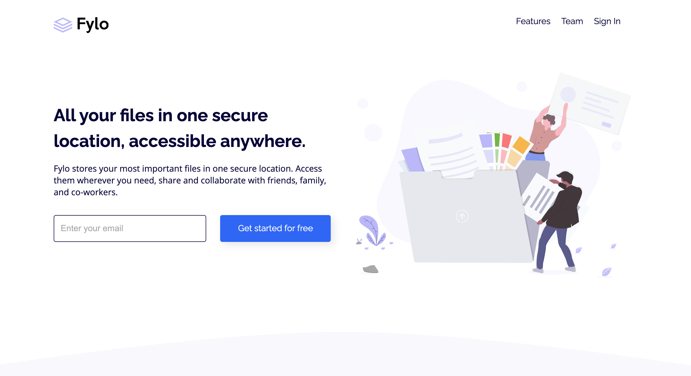

# Frontend Mentor - Fylo landing page with two column layout solution

This is a solution to the [Fylo landing page with two column layout challenge on Frontend Mentor](https://www.frontendmentor.io/challenges/fylo-landing-page-with-two-column-layout-5ca5ef041e82137ec91a50f5). Frontend Mentor challenges help you improve your coding skills by building realistic projects. 

## Table of contents

- [Overview](#overview)
  - [The challenge](#the-challenge)
  - [Screenshot](#screenshot)
  - [Links](#links)
- [My process](#my-process)
  - [Built with](#built-with)
  - [What I learned](#what-i-learned)
- [Author](#author)


## Overview

### The challenge

Users should be able to:

- View the optimal layout for the site depending on their device's screen size
- See hover states for all interactive elements on the page

### Screenshot




### Links

- Solution URL: [Add solution URL here](https://github.com/desmavi/fylo)
- Live Site URL: [https://desmavi.github.io/fylo](https://desmavi.github.io/fylo)

## My process

### Built with

- Semantic HTML5 markup
- CSS custom properties
- Flexbox
- Mobile-first workflow
- Fontawesome Icons [Fontawesome](https://fontawesome.com)


### What I learned

I decided to code this website in plain HTML & CSS, without using any frameworks. 
However I find that some Bootstrap conventions are  very helpful (for example the grid system) and I used some of them in my CSS.


```css
.col-md-6 {
  ...
}

.justify-content-center {
  justify-content: center;
}
```

For this project, as in the majority of the projects I worked on, I adopted a Mobile-first workflow.

Mobile first design approach allows you to think about what actually needs to be on your site. Instead of trying to fill in all the whitespace with fluff, you can give priority to what the user actually needs to complete the action.


I also focused on the indentation of my code.
I think that a good indentation is key, especially if you collaborate with other people.
The code is more readable and it's easier to find what you're looking for.


## Author

- Frontend Mentor - [@desmavi](https://www.frontendmentor.io/profile/desmavi)
- Twitter - [@desmavi](https://twitter.com/desmavi)

